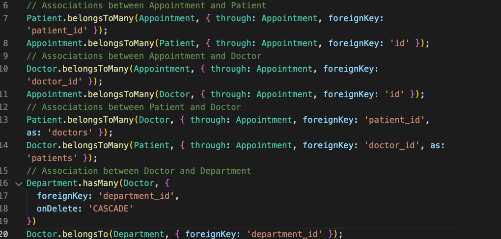
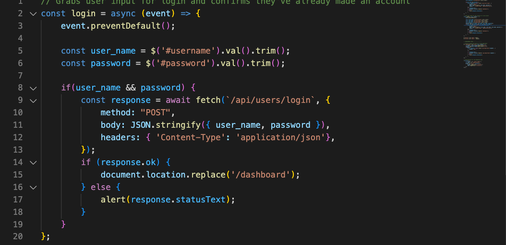
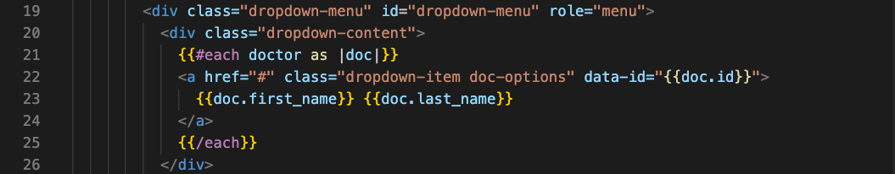

# Appointment-Manager

## Description
Hospital Appointment Manager is an appointment creation application for a mock
hospital.  This application has a login/sign-up page, a dashboard page that displays
different departments of the hospital such as cardiology, pediatrics, Neurology, and more.
Upon selecting a department, the user is brought to a sign up page that gives a dropdown menu
of available doctors in that department and options for a date and time as well as a
message for the reason of the visit.  Once submitted, the appointment and it's attributes are shown
in the profile page, which includes the doctor's name, the date/time, and the room number.  The user 
is given an option to cancel the appointment as well.

## Technologies Used
* Javascript
* jQuery/jQueryUI
* mySQL
* Express
* CSS/Bulma
* Handlebars
* Sequelize ORM
* Nodejs
* NPM
* Bcrypt
* Web API

## Deployed Site

Deployed on heroku at - - - >  http://ham-app-manager.herokuapp.com/ < - - - - - - -

## Demonstration 

https://drive.google.com/file/d/17-QH_G12L5vz9IRiV-f18wTDlGGf55_U/view 

## Code Snippets

 
This is the creation of relationships between our models to allow for dynamic fetching of information from our database. 
 
Small snippet showing how the user's login information was fetched, confirming they've already made an account, and directs the user to the dashboard page.
 
Small code snippet showing how we dynamically generated our Appointment html page using handlebars.

## Contributors
* Laura Sierra 
* Liam McCarthy 
    * github - ltmccarthy9
    * email - ltmccarthy9@gmail.com
* Jeffrey Zhang
    - View my Github [profile](https://github.com/jeffz98)
    - Contact me at my [email](mailto:jeffz98@berkeley.edu) 

## License

MIT License

Copyright (c) 2022 Laura

Permission is hereby granted, free of charge, to any person obtaining a copy
of this software and associated documentation files (the "Software"), to deal
in the Software without restriction, including without limitation the rights
to use, copy, modify, merge, publish, distribute, sublicense, and/or sell
copies of the Software, and to permit persons to whom the Software is
furnished to do so, subject to the following conditions:

The above copyright notice and this permission notice shall be included in all
copies or substantial portions of the Software.

THE SOFTWARE IS PROVIDED "AS IS", WITHOUT WARRANTY OF ANY KIND, EXPRESS OR
IMPLIED, INCLUDING BUT NOT LIMITED TO THE WARRANTIES OF MERCHANTABILITY,
FITNESS FOR A PARTICULAR PURPOSE AND NONINFRINGEMENT. IN NO EVENT SHALL THE
AUTHORS OR COPYRIGHT HOLDERS BE LIABLE FOR ANY CLAIM, DAMAGES OR OTHER
LIABILITY, WHETHER IN AN ACTION OF CONTRACT, TORT OR OTHERWISE, ARISING FROM,
OUT OF OR IN CONNECTION WITH THE SOFTWARE OR THE USE OR OTHER DEALINGS IN THE
SOFTWARE.
